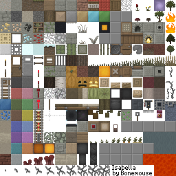

isabella-texture-pack
=====================
A require()-able version of the Eventime texture pack.  The resulting image is exposed as an ndarray.

## Install

    npm install eventime-texture
    
### `require("eventime-texture")()`
Returns an ndarray encoding the textures as a 256x256x4 array

## Credits

(c) 2011-2013 Bonemouse.  [Creative commons attribution 3.0](http://creativecommons.org/licenses/by/3.0/us/)  For more information see the following thread: [http://www.minecraftforum.net/topic/242175-Isabella/](http://www.minecraftforum.net/topic/242175-Isabella/)

node.js package maintained by Mikola Lysenko